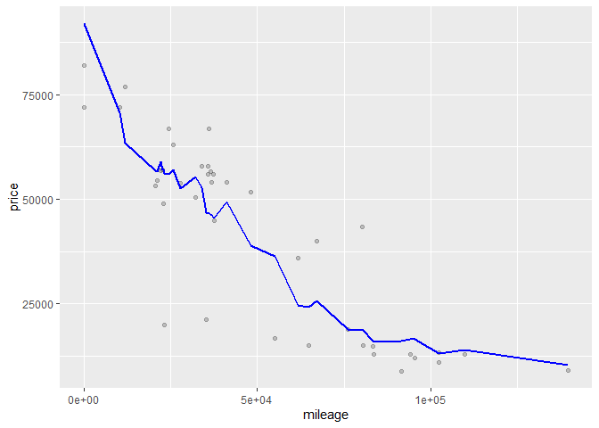
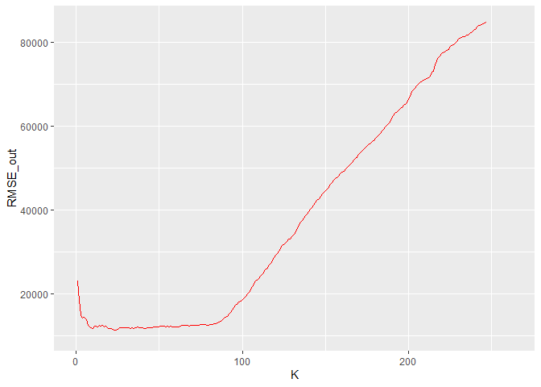
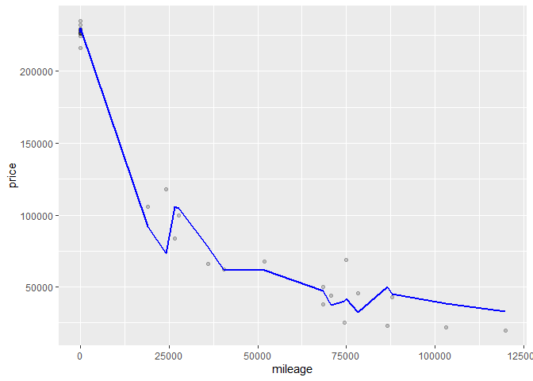

Data Mining HW1
================
Wen-Hsin Chang
2021/1/29

## Q1 Data visualization:gas prices

\#The theories

A.) Gas stations charge more if they lack direct competition in sight
(boxplot).

<!-- -->

The theory seems to be unsupported by the data. Specifically, the box
plot shows that gas station without competitors sets higher price.

B.) The richer the area, the higher the gas price (scatter plot).

<!-- -->

The theory seems to be supported by the data. Specifically, the scatter
plot shows that richer areas has higher price.

C.) Shell charges more than other brands (bar plot).

<!-- -->

The theory seems to be supported by the data, but to a lesser degree.
Specifically, the bar plot shows that Shell charges slightly more than
other brands.

D.) Gas stations at stoplights charge more (faceted histogram).

<!-- -->

The theory seems to be supported by the data. Specifically, the faceted
histogram shows that Gas stations at stoplights charge more. We can use
the skewness of the distribution to help our assessment.

E.) Gas stations with direct highway access charge more (your choice of
plot).

<!-- -->

The theory seems to be supported by the data. Specifically, the box plot
shows that Gas stations with direct highway access charge more.

## Q2 Data visualization:a bike share network

A.)Plot A: a line graph showing average bike rentals (Avg.Rentals)
versus hour of the day (hr).

<!-- -->

The average rental spikes at around 8 am and 5pm, which makes intuitive
sense because people may commute by rental bike to avoid traffic jams.

B.) Plot B:a faceted line graph showing average bike rentals versus hour
of the day, faceted according to whether it is a working day

<!-- -->

On a typical working day, bike rental spikes at around 8 am and 5 pm but
on a typical weekend, bike rental spikes in the afternoon.

c.)Plot C: a faceted bar plot showing average ridership during the 8 AM
hour by weather situation code (weathersit), faceted according to
whether it is a working day or not

<!-- -->

Bike rental spikes (vs plunges) when the weather is good (vs bad). The
theory holds for both working day and weekend.

## Q3 Data visualization:Flights at ABIA

A.) What is the best time of day to fly to minimize delays (I do not
care about arriving early) ? Does this change by airline?

<!-- -->

Based on the result above, on average, 18-24 pm is more likely to
encounter arrival delay (worst time to fly), and 0-6 am is less likely
to encounter arrival delay (best time to fly).

<!-- -->

Although 18-24 pm is more likely to encounter arrival delay, the result
changes by airline. For instance, airline“9E” is more likely to delay at
0-6 am, and airline “UA” is more likely to delay at 12-18 pm.

B.)What is the best time of year to fly to minimize delays? Does this
change by destination?

<!-- -->

Based on the result above, the best time of the year to fly seems to be
May and the worst time to fly seems to be December, but the result
varies by destination.

<!-- -->

For instance, the best time to fly to “AUS” airport seems to be October,
and the best time to fly to “EWR” seems to be January.

C.)What are the bad airports to fly?

<!-- -->

I focus on some of the most popular airport and find that, based on the
result above, “EWR” and “SFO” are two of the airports that delay the
most. The result makes intuitive sense since New York and San Francisco
are two of the most popular destinations in the US.

## Q4 K-nearest neighbots

\#Trim Level filter:350

\#train/test split (0.1/0.9)

KNN with K = 2

    ## [1] 13144.98

KNN with K = 5

    ## [1] 12401.52

KNN with K = 10

    ## [1] 12410.25

\#RMSE versus K

<!-- -->

\#Optimal at K=17…

<!-- -->

\#Trim Level filter:65AMG

\#train/test split (0.1/0.9)

KNN with K = 2

    ## [1] 22415.92

KNN with K = 5

    ## [1] 20031.93

KNN with K = 10

    ## [1] 17720.97

\#RMSE versus K

<!-- -->
 \#Optimal at K=6

<!-- -->

According to my train-test split(0.1/0/9) 350 yield slightly greater
value of K, but since the sample is not very big, it depends on the
random process that R assign the train/test split. I think the reason
that two trim has different values of K is mainly because 65 AMG has
smaller data size, and its mileage information varies less.
